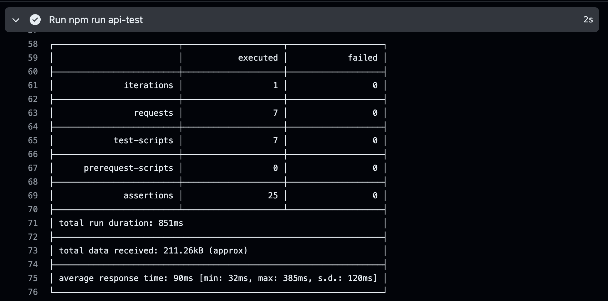
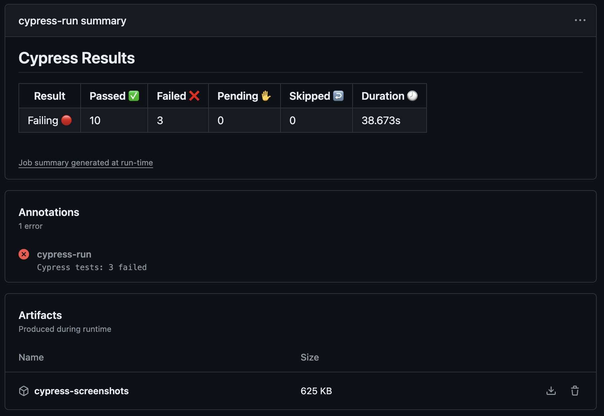

# Kiosko Automation Testing Challenge

### Getting Started

- UI Test Sripts: [Tenku Website](https://microsegurosfrontsandbox.z19.web.core.windows.net)
- API Test Scripts: [REST Countries](https://restcountries.com/)

A step-by-step series of examples that tell you how to execute test scripts locally.

### Prerequisites

- Install [Node.js](https://nodejs.org/en/download/current/)
- Install [Git](https://git-scm.com/downloads)
- Install the devDependencies from the package.json file:
   `npm run install`

## Execute UI Test Scripts

A step by step series of examples that tell you how to get execute test. scripts locally.

**1)** Script to open the Cypress application and visualize the test:

   `npm run ui-test`

**2)** Scripts to execute the e2e UI tests in headless mode and multiple browsers:

   `npm run headless-chrome`

   `npm run headless-firefox`

   `npm run headless-edge`

   `npm run headless-electron`

**NOTE:** If any test fails, screenshots will be saved in the following path:

   `cypress/screenshots`

## Execute API Test Scripts

**1)** Script to execute the API test scripts:

   `npm run api-test`
 
## Continuous Integration (CI) with GitHub Actions

- Every pull request will execute the UI and API test scripts on [GitHub Actions](https://github.com/PaulinaMontoya/Kiosko_Automation_Testing_Challenge/actions) and will show a report.

   - [API Test Scripts Results](https://github.com/PaulinaMontoya/Kiosko_Automation_Testing_Challenge/actions/workflows/ci_api.yml)
      - The logs of the job will show the results of the API test suite execution.
      
   - [UI Test Scripts Result](https://github.com/PaulinaMontoya/Kiosko_Automation_Testing_Challenge/actions/workflows/ci_ui.yml)
      - A report will be created regarding the UI test suite execution, allowing you to download screenshots of failed tests.
      

## Built With

  - [cypress](https://www.npmjs.com/package/cypress) - Used
    for the UI test suite
  - [cypress-wait-until](https://www.npmjs.com/package/cypress-wait-until) - Used to apply custom waits
  - [cypress-xpath](https://www.npmjs.com/package/cypress-xpath) - Used to select elements without unique attributes
  - [postman](https://www.postman.com/) - Used for the API test suite
  - [newman](https://www.npmjs.com/package/newman) - Used to execute the API test scripts via the command line

## Author

  - **Paulina Montoya**
    [LinkedIn](https://www.linkedin.com/in/paulinamontoya/)
